# ECHO 全项目流程图（最新版）

> 快照日期：2026-10-16
> 最新正式标签：`v0.0.255`
> Alembic head：`b1c2d3e4f5a6`
> 基线：主仓库 `<repo>` 当前已提交实现。
> 说明：工作区仍有其他线程的未提交 UI 改动，本流程图不把未提交实验性界面当作稳定架构。

## 1. 整体系统拓扑

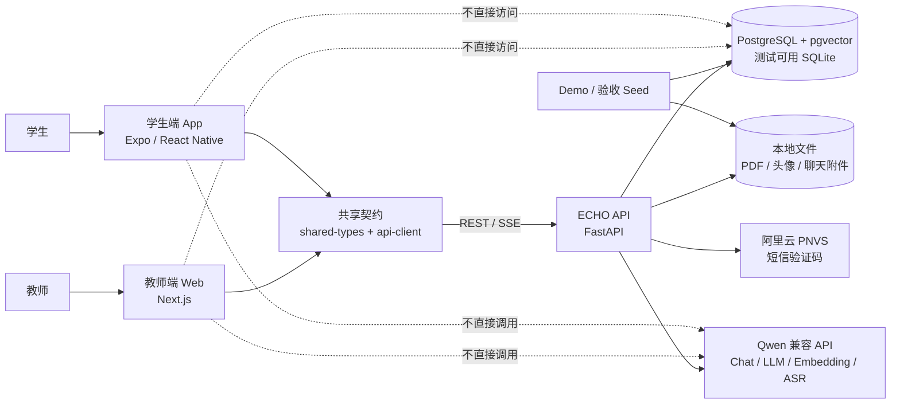
```mermaid
flowchart LR
    Teacher["教师"] --> Web["教师端 Web<br/>Next.js"]
    Student["学生"] --> Mobile["学生端 App<br/>Expo / React Native"]

    Web --> Contract["共享契约<br/>shared-types + api-client"]
    Mobile --> Contract
    Contract -->|"REST / SSE"| API["ECHO API<br/>FastAPI"]

    API --> DB[("PostgreSQL + pgvector<br/>测试可用 SQLite")]
    API --> Files[("本地文件<br/>PDF / 头像 / 聊天附件")]
    API --> Qwen["Qwen 兼容 API<br/>Chat / LLM / Embedding / ASR"]
    API --> SMS["阿里云 PNVS<br/>短信验证码"]

    Seed["Demo / 验收 Seed"] --> DB
    Seed --> Files

    Web -.->|"不直接访问"| DB
    Mobile -.->|"不直接访问"| DB
    Web -.->|"不直接调用"| Qwen
    Mobile -.->|"不直接调用"| Qwen
```

核心边界：

- 教师端和学生端只通过 `@echo/shared-types` 与 `@echo/api-client` 访问后端。
- 前端不直接读写数据库，不直接调用 Qwen，不持有模型 API Key。
- 后端统一负责认证、课程归属、角色权限、业务事务和外部服务调用。
- PostgreSQL + pgvector 是正式目标；SQLite 主要用于开发和测试。
- 文件当前写入本地存储目录，并非对象存储。

## 2. 仓库与模块依赖

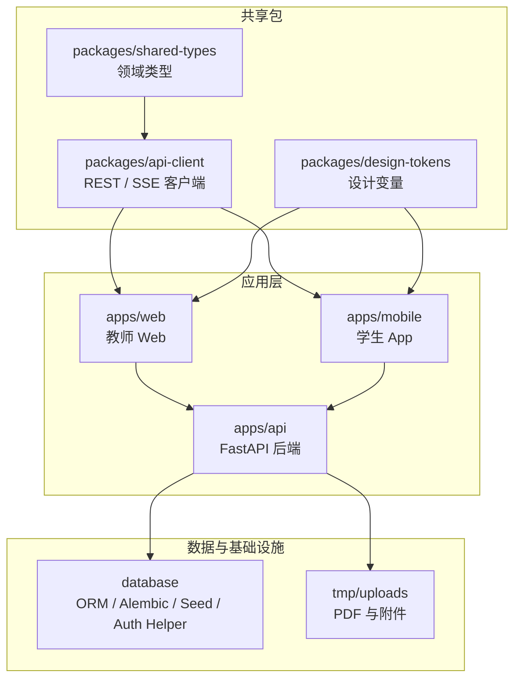
```mermaid
flowchart TB
    subgraph Apps["应用层"]
        Web["apps/web<br/>教师 Web"]
        Mobile["apps/mobile<br/>学生 App"]
        Api["apps/api<br/>FastAPI 后端"]
    end

    subgraph Packages["共享包"]
        Types["packages/shared-types<br/>领域类型"]
        Client["packages/api-client<br/>REST / SSE 客户端"]
        Tokens["packages/design-tokens<br/>设计变量"]
    end

    subgraph Data["数据与基础设施"]
        Database["database<br/>ORM / Alembic / Seed / Auth Helper"]
        Storage["tmp/uploads<br/>PDF 与附件"]
    end

    Types --> Client
    Client --> Web
    Client --> Mobile
    Tokens --> Web
    Tokens --> Mobile

    Web --> Api
    Mobile --> Api
    Api --> Database
    Api --> Storage
```

## 3. 后端请求生命周期

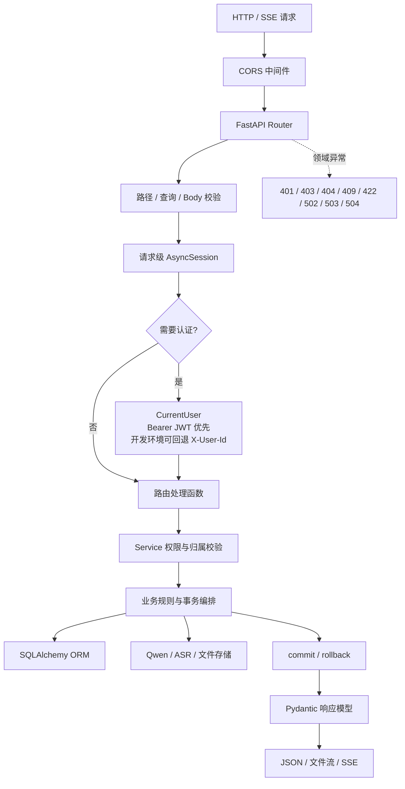
```mermaid
flowchart TB
    Request["HTTP / SSE 请求"] --> CORS["CORS 中间件"]
    CORS --> Route["FastAPI Router"]
    Route --> Params["路径 / 查询 / Body 校验"]
    Params --> Session["请求级 AsyncSession"]
    Session --> Auth{"需要认证?"}

    Auth -->|"是"| CurrentUser["CurrentUser<br/>Bearer JWT 优先<br/>开发环境可回退 X-User-Id"]
    Auth -->|"否"| Handler["路由处理函数"]
    CurrentUser --> Handler

    Handler --> Permission["Service 权限与归属校验"]
    Permission --> Domain["业务规则与事务编排"]
    Domain --> DB["SQLAlchemy ORM"]
    Domain --> Provider["Qwen / ASR / 文件存储"]
    Domain --> Commit["commit / rollback"]
    Commit --> Schema["Pydantic 响应模型"]
    Schema --> Response["JSON / 文件流 / SSE"]

    Route -.->|"领域异常"| Errors["401 / 403 / 404 / 409 / 422 / 502 / 503 / 504"]
```

后端 Router 当前按领域挂载：

```text
analysis, announcements, auth, chat, chunks, courses, dashboard,
dashboard_details, demo, documents, knowledge_graph_embed, knowledge,
learning, notifications, planning, review, quick_check, system, search,
student_resources, teaching_policy, teacher_resources, teacher_assistant,
users, health
```

## 4. 数据库聚合关系

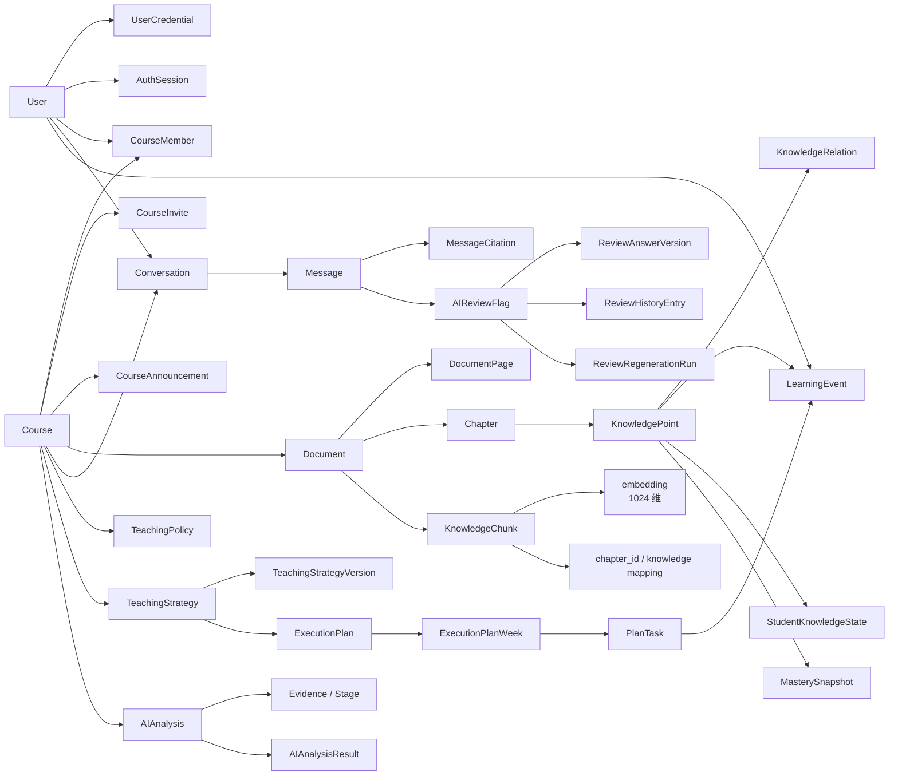
```mermaid
flowchart LR
    User["User"] --> Credential["UserCredential"]
    User --> AuthSession["AuthSession"]
    User --> Member["CourseMember"]
    Course["Course"] --> Member
    Course --> Invite["CourseInvite"]
    Course --> Announcement["CourseAnnouncement"]

    Course --> Document["Document"]
    Document --> Page["DocumentPage"]
    Document --> Chapter["Chapter"]
    Chapter --> KnowledgePoint["KnowledgePoint"]
    KnowledgePoint --> Relation["KnowledgeRelation"]
    Document --> Chunk["KnowledgeChunk"]
    Chunk --> Embedding["embedding<br/>1024 维"]
    Chunk --> ChunkChapter["chapter_id / knowledge mapping"]

    User --> Conversation["Conversation"]
    Course --> Conversation
    Conversation --> Message["Message"]
    Message --> Citation["MessageCitation"]
    Message --> ReviewFlag["AIReviewFlag"]
    ReviewFlag --> ReviewVersion["ReviewAnswerVersion"]
    ReviewFlag --> ReviewHistory["ReviewHistoryEntry"]
    ReviewFlag --> Regeneration["ReviewRegenerationRun"]

    KnowledgePoint --> LearningEvent["LearningEvent"]
    User --> LearningEvent
    KnowledgePoint --> MasteryState["StudentKnowledgeState"]
    KnowledgePoint --> Snapshot["MasterySnapshot"]

    Course --> Policy["TeachingPolicy"]
    Course --> Strategy["TeachingStrategy"]
    Strategy --> StrategyVersion["TeachingStrategyVersion"]
    Strategy --> Plan["ExecutionPlan"]
    Plan --> Week["ExecutionPlanWeek"]
    Week --> Task["PlanTask"]
    Task --> LearningEvent

    Course --> Analysis["AIAnalysis"]
    Analysis --> AnalysisEvidence["Evidence / Stage"]
    Analysis --> AnalysisResult["AIAnalysisResult"]
```

## 5. 教师端主流程

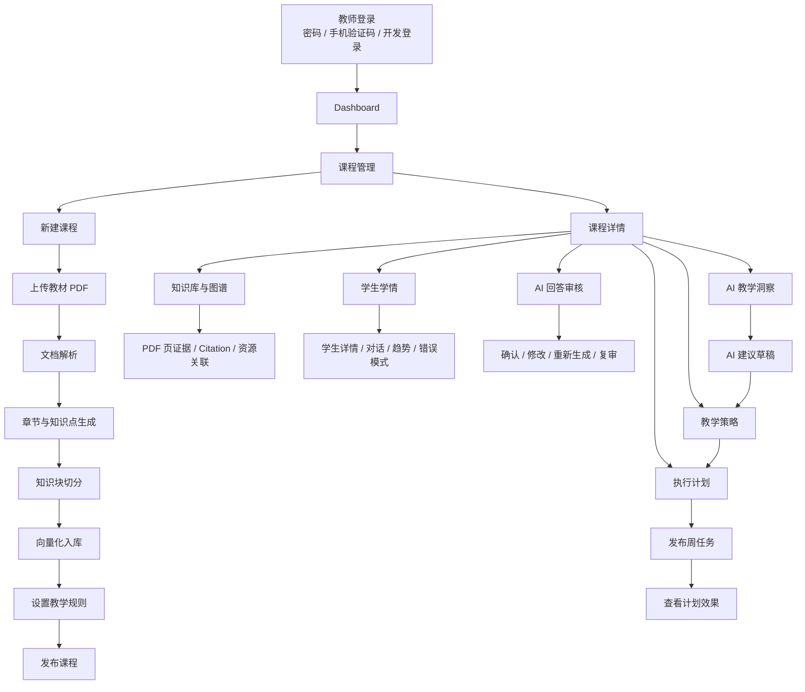
```mermaid
flowchart TB
    Login["教师登录<br/>密码 / 手机验证码 / 开发登录"] --> Dashboard["Dashboard"]
    Dashboard --> CourseList["课程管理"]
    CourseList --> NewCourse["新建课程"]
    CourseList --> CourseDetail["课程详情"]

    NewCourse --> Upload["上传教材 PDF"]
    Upload --> Parse["文档解析"]
    Parse --> Structure["章节与知识点生成"]
    Structure --> Chunking["知识块切分"]
    Chunking --> Embedding["向量化入库"]
    Embedding --> Policy["设置教学规则"]
    Policy --> Publish["发布课程"]

    CourseDetail --> Knowledge["知识库与图谱"]
    CourseDetail --> Students["学生学情"]
    CourseDetail --> Review["AI 回答审核"]
    CourseDetail --> Insights["AI 教学洞察"]
    CourseDetail --> Strategies["教学策略"]
    CourseDetail --> Plans["执行计划"]

    Knowledge --> ResourceEvidence["PDF 页证据 / Citation / 资源关联"]
    Students --> StudentDetail["学生详情 / 对话 / 趋势 / 错误模式"]
    Review --> ReviewDecision["确认 / 修改 / 重新生成 / 复审"]
    Insights --> StrategyDraft["AI 建议草稿"]
    StrategyDraft --> Strategies
    Strategies --> Plans
    Plans --> TaskPublish["发布周任务"]
    TaskPublish --> Effect["查看计划效果"]
```

教师端主路由：

```text
/dashboard
/courses
/courses/new
/courses/{courseId}
/knowledge
/knowledge/points/{knowledgePointId}
/knowledge/resources/{resourceId}
/students
/students/{studentId}
/students/{studentId}/conversations/{conversationId}
/ai-review
/ai-review/pending
/ai-insights
/teaching-strategies
/teaching-strategies/{strategyId}
/execution-plans/new
/execution-plans/{planId}
/settings/server
/settings/demo
/me
```

## 6. 学生端主流程

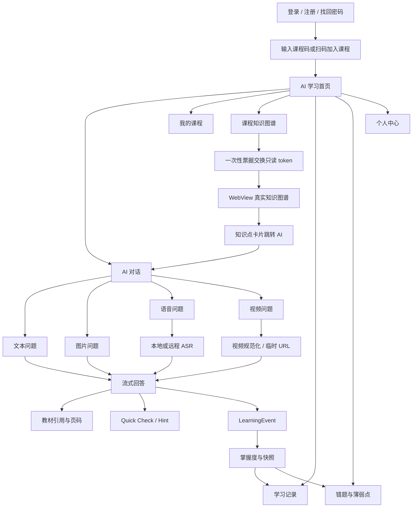
```mermaid
flowchart TB
    Auth["登录 / 注册 / 找回密码"] --> Join["输入课程码或扫码加入课程"]
    Join --> Home["AI 学习首页"]

    Home --> Chat["AI 对话"]
    Home --> Course["我的课程"]
    Home --> Graph["课程知识图谱"]
    Home --> Records["学习记录"]
    Home --> Wrong["错题与薄弱点"]
    Home --> Me["个人中心"]

    Chat --> Text["文本问题"]
    Chat --> Image["图片问题"]
    Chat --> Audio["语音问题"]
    Chat --> Video["视频问题"]
    Text --> Answer["流式回答"]
    Image --> Answer
    Audio --> ASR["本地或远程 ASR"] --> Answer
    Video --> Media["视频规范化 / 临时 URL"] --> Answer

    Answer --> Citation["教材引用与页码"]
    Answer --> QuickCheck["Quick Check / Hint"]
    Answer --> Event["LearningEvent"]
    Event --> Mastery["掌握度与快照"]
    Mastery --> Records
    Mastery --> Wrong

    Graph --> EmbedAuth["一次性票据交换只读 token"]
    EmbedAuth --> GraphView["WebView 真实知识图谱"]
    GraphView --> AskAI["知识点卡片跳转 AI"]
    AskAI --> Chat
```

学生端主路由：

```text
/login
/register
/forgot-password
/reset-password
/join-course
/(tabs)/ai
/(tabs)/courses
/(tabs)/me
/courses/{courseId}
/courses/{courseId}/chapters/{chapterId}
/knowledge/{knowledgePointId}
/knowledge-graph
/chat
/learning-records
/wrong-questions
/change-password
/network-settings
```

## 7. 教材到 RAG 可检索数据

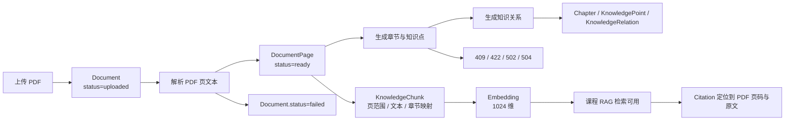
```mermaid
flowchart LR
    Upload["上传 PDF"] --> Stored["Document<br/>status=uploaded"]
    Stored --> Parse["解析 PDF 页文本"]
    Parse --> Pages["DocumentPage<br/>status=ready"]
    Pages --> Generate["生成章节与知识点"]
    Generate --> Relations["生成知识关系"]
    Relations --> Chapters["Chapter / KnowledgePoint / KnowledgeRelation"]
    Pages --> Chunks["KnowledgeChunk<br/>页范围 / 文本 / 章节映射"]
    Chunks --> Vectors["Embedding<br/>1024 维"]
    Vectors --> Search["课程 RAG 检索可用"]

    Parse --> ParseFail["Document.status=failed"]
    Generate --> StructureFail["409 / 422 / 502 / 504"]
    Search --> Citation["Citation 定位到 PDF 页码与原文"]
```

当前教师课程向导按四条请求串行执行：

```text
POST /documents/{document_id}/parse
POST /documents/{document_id}/generate-structure
POST /documents/{document_id}/chunks
POST /documents/{document_id}/embeddings
```

前端对这四个长耗时接口使用单接口 10 分钟超时；其他接口仍使用 4 分钟默认超时。

## 8. 章节识别与关系生成内部流程

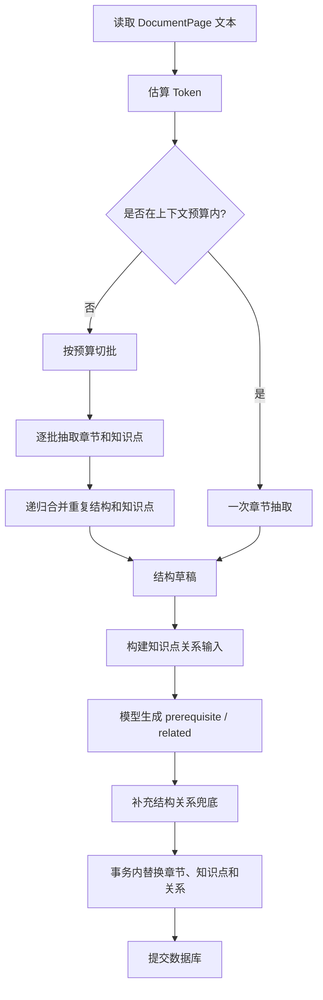
```mermaid
flowchart TB
    Pages["读取 DocumentPage 文本"] --> Estimate["估算 Token"]
    Estimate --> Budget{"是否在上下文预算内?"}

    Budget -->|"是"| Single["一次章节抽取"]
    Budget -->|"否"| Batch["按预算切批"]
    Batch --> Extract["逐批抽取章节和知识点"]
    Extract --> Merge["递归合并重复结构和知识点"]
    Merge --> Drafts["结构草稿"]
    Single --> Drafts

    Drafts --> RelationPoints["构建知识点关系输入"]
    RelationPoints --> RelationLLM["模型生成 prerequisite / related"]
    RelationLLM --> Fallback["补充结构关系兜底"]
    Fallback --> Replace["事务内替换章节、知识点和关系"]
    Replace --> Commit["提交数据库"]
```

规则：

- 章节和知识点全部来自模型输出与教材文本，不用前端硬编码。
- 关系类型只保留 `prerequisite` 与 `related` 的标准投影。
- 生成失败不会写半套结构；事务失败会回滚。
- 同一文档的结构生成会替换旧结构，并维护知识点关联数据。

## 9. 学生 AI 问答与 Agent 决策链

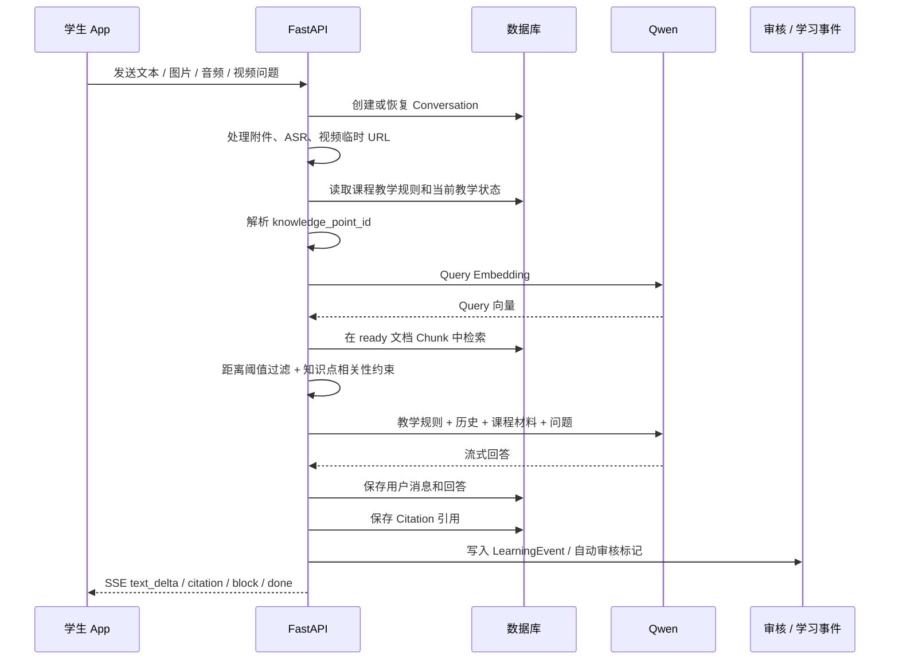
```mermaid
sequenceDiagram
    participant S as 学生 App
    participant A as FastAPI
    participant DB as 数据库
    participant M as Qwen
    participant R as 审核 / 学习事件

    S->>A: 发送文本 / 图片 / 音频 / 视频问题
    A->>DB: 创建或恢复 Conversation
    A->>A: 处理附件、ASR、视频临时 URL
    A->>DB: 读取课程教学规则和当前教学状态
    A->>A: 解析 knowledge_point_id
    A->>M: Query Embedding
    M-->>A: Query 向量
    A->>DB: 在 ready 文档 Chunk 中检索
    A->>A: 距离阈值过滤 + 知识点相关性约束
    A->>M: 教学规则 + 历史 + 课程材料 + 问题
    M-->>A: 流式回答
    A->>DB: 保存用户消息和回答
    A->>DB: 保存 Citation 引用
    A->>R: 写入 LearningEvent / 自动审核标记
    A-->>S: SSE text_delta / citation / block / done
```

Agent 约束：

- 教学规则影响回答语气、步骤和提示层级，但不允许绕过课程资料事实。
- RAG 检索为空或超出距离阈值时，回答不能伪造教材引用。
- 只有显式携带有效 `knowledge_point_id`，且问题与知识点实质相关、来源属于同章节时，才生成知识点问答卡片、Hint 和 Quick Check。
- 教师会话不会生成学生问题审核项。
- 学生、会话、消息、知识点和课程归属必须一致。

## 10. 多模态输入处理

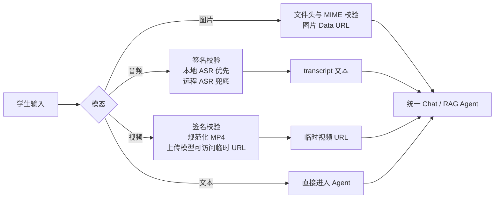
```mermaid
flowchart LR
    Input["学生输入"] --> Kind{"模态"}

    Kind -->|"文本"| Text["直接进入 Agent"]
    Kind -->|"图片"| Image["文件头与 MIME 校验<br/>图片 Data URL"]
    Kind -->|"音频"| Audio["签名校验<br/>本地 ASR 优先<br/>远程 ASR 兜底"]
    Kind -->|"视频"| Video["签名校验<br/>规范化 MP4<br/>上传模型可访问临时 URL"]

    Image --> Agent["统一 Chat / RAG Agent"]
    Audio --> Transcript["transcript 文本"] --> Agent
    Video --> VideoURL["临时视频 URL"] --> Agent
    Text --> Agent
```

## 11. 学习事件、掌握度和教师干预闭环

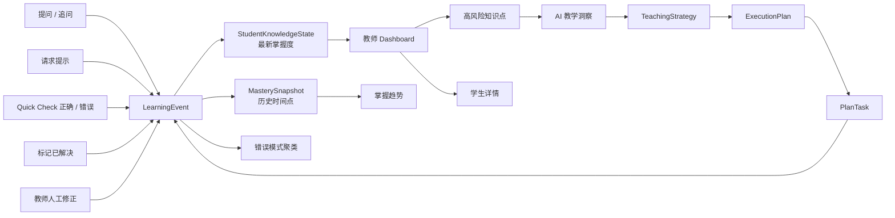
```mermaid
flowchart LR
    Question["提问 / 追问"] --> Event["LearningEvent"]
    Hint["请求提示"] --> Event
    Quiz["Quick Check 正确 / 错误"] --> Event
    Resolved["标记已解决"] --> Event
    TeacherFix["教师人工修正"] --> Event

    Event --> State["StudentKnowledgeState<br/>最新掌握度"]
    Event --> Snapshot["MasterySnapshot<br/>历史时间点"]
    State --> Dashboard["教师 Dashboard"]
    Snapshot --> Trend["掌握趋势"]
    Event --> Error["错误模式聚类"]
    Dashboard --> Risk["高风险知识点"]
    Dashboard --> StudentDetail["学生详情"]
    Risk --> Insight["AI 教学洞察"]
    Insight --> Strategy["TeachingStrategy"]
    Strategy --> Plan["ExecutionPlan"]
    Plan --> Task["PlanTask"]
    Task --> Event
```

## 12. AI 回答审核闭环

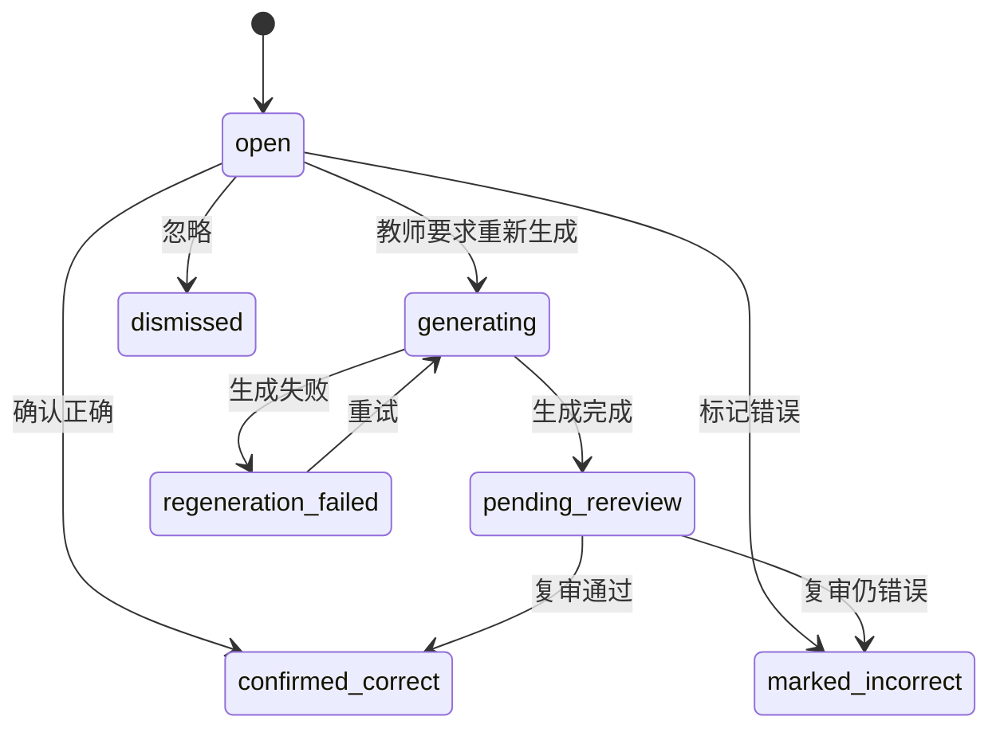
```mermaid
stateDiagram-v2
    [*] --> open
    open --> generating: 教师要求重新生成
    generating --> pending_rereview: 生成完成
    generating --> regeneration_failed: 生成失败
    regeneration_failed --> generating: 重试
    open --> confirmed_correct: 确认正确
    open --> marked_incorrect: 标记错误
    open --> dismissed: 忽略
    pending_rereview --> confirmed_correct: 复审通过
    pending_rereview --> marked_incorrect: 复审仍错误
```

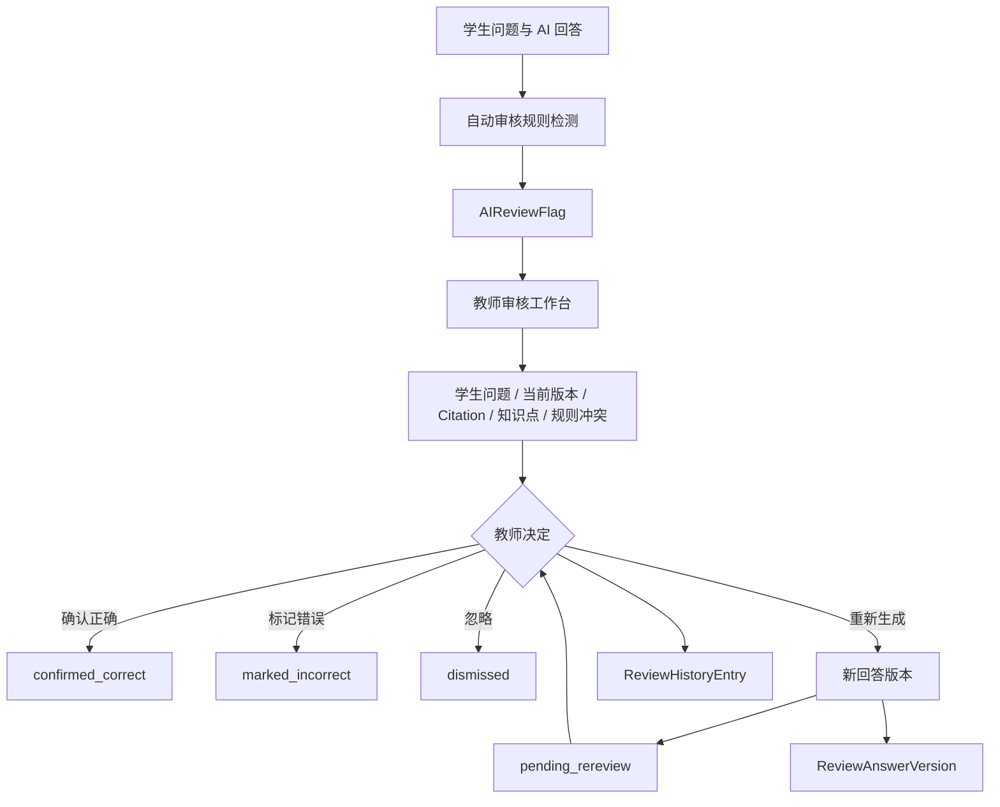
```mermaid
flowchart TB
    StudentMsg["学生问题与 AI 回答"] --> Detect["自动审核规则检测"]
    Detect --> Flag["AIReviewFlag"]
    Flag --> TeacherQueue["教师审核工作台"]
    TeacherQueue --> Context["学生问题 / 当前版本 / Citation / 知识点 / 规则冲突"]
    Context --> Decision{"教师决定"}

    Decision -->|"确认正确"| Correct["confirmed_correct"]
    Decision -->|"标记错误"| Incorrect["marked_incorrect"]
    Decision -->|"忽略"| Dismiss["dismissed"]
    Decision -->|"重新生成"| Regenerate["新回答版本"]
    Regenerate --> Rereview["pending_rereview"]
    Rereview --> Decision

    Decision --> History["ReviewHistoryEntry"]
    Regenerate --> Version["ReviewAnswerVersion"]
```

## 13. 教师知识助手流程

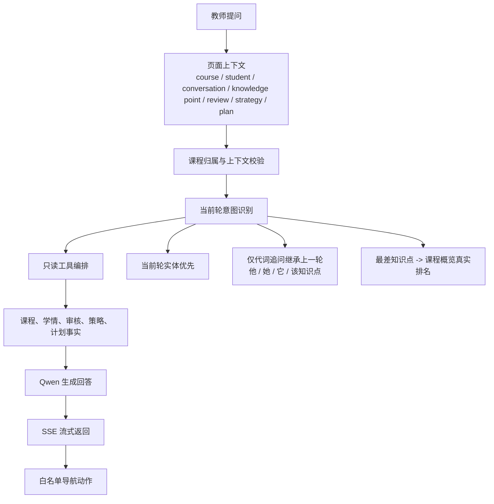
```mermaid
flowchart TB
    Teacher["教师提问"] --> Context["页面上下文<br/>course / student / conversation / knowledge point / review / strategy / plan"]
    Context --> Validate["课程归属与上下文校验"]
    Validate --> Intent["当前轮意图识别"]
    Intent --> Tools["只读工具编排"]
    Tools --> Facts["课程、学情、审核、策略、计划事实"]
    Facts --> Qwen["Qwen 生成回答"]
    Qwen --> Streaming["SSE 流式返回"]
    Streaming --> Actions["白名单导航动作"]

    Intent --> CurrentTurn["当前轮实体优先"]
    Intent --> FollowUp["仅代词追问继承上一轮<br/>他 / 她 / 它 / 该知识点"]
    Intent --> GlobalWorst["最差知识点 -> 课程概览真实排名"]
```

安全边界：

- 教师助手只读，不修改课程、学情、审核、策略或计划。
- 历史消息不得污染新问题实体。
- 学生、教材、工具输出都视为不可信数据。
- 页面跳转只从结构化白名单动作生成。

## 14. 教学洞察、策略与执行计划


```mermaid
flowchart LR
    Evidence["课程证据<br/>LearningEvent / Mastery / Conversation / Review"] --> Analysis["AI 二次分析"]
    Analysis --> Stages["五阶段进度<br/>collecting -> querying -> expanding -> analyzing -> generating"]
    Stages --> Result["分析结果与建议"]

    Result --> Strategy["TeachingStrategy<br/>初始 suggested"]
    Strategy --> Adopt{"教师动作"}
    Adopt -->|"采纳"| Active["active"]
    Adopt -->|"编辑"| Version["策略版本"]
    Active --> Plan["ExecutionPlan<br/>初始 draft"]
    Plan --> Generate["生成周计划与任务"]
    Generate --> Publish["教师发布"]
    Publish --> Tasks["学生执行 PlanTask"]
    Tasks --> Events["计划关联 LearningEvent"]
    Events --> Effect["计划 / 策略效果评估"]
```

AI 结果不得直接发布；发布、采纳、暂停、继续、完成都必须由教师操作触发。

## 15. 学生知识图谱 WebView 授权

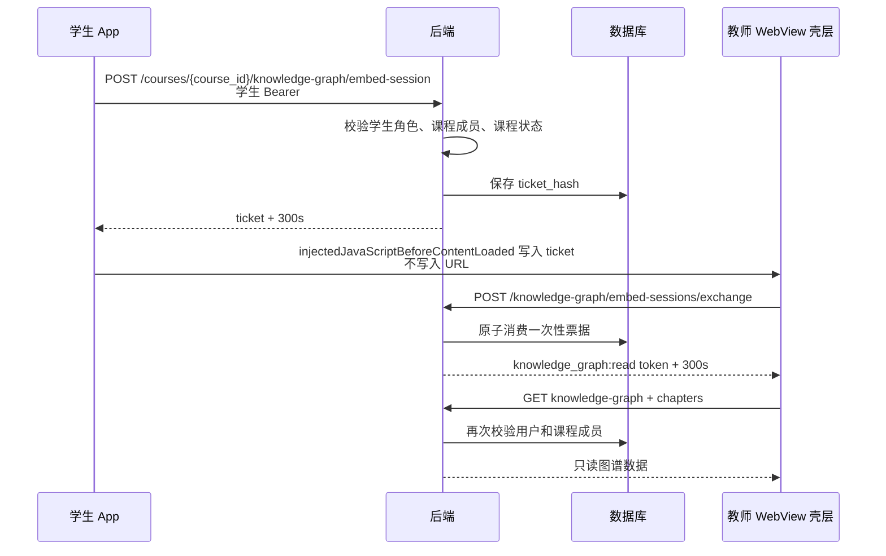
```mermaid
sequenceDiagram
    participant S as 学生 App
    participant API as 后端
    participant DB as 数据库
    participant W as 教师 WebView 壳层

    S->>API: POST /courses/{course_id}/knowledge-graph/embed-session<br/>学生 Bearer
    API->>API: 校验学生角色、课程成员、课程状态
    API->>DB: 保存 ticket_hash
    API-->>S: ticket + 300s
    S->>W: injectedJavaScriptBeforeContentLoaded 写入 ticket<br/>不写入 URL
    W->>API: POST /knowledge-graph/embed-sessions/exchange
    API->>DB: 原子消费一次性票据
    API-->>W: knowledge_graph:read token + 300s
    W->>API: GET knowledge-graph + chapters
    API->>DB: 再次校验用户和课程成员
    API-->>W: 只读图谱数据
```

限制：

- 嵌入 token 使用独立类型，不能通过通用 `CurrentUser`。
- 只允许读取图谱和章节，任何写接口都会拒绝。
- 普通学生 token 不能直接访问教师图谱接口。
- 路径课程必须与 token 的 `course_id` 一致。

## 16. 认证与手机号流程

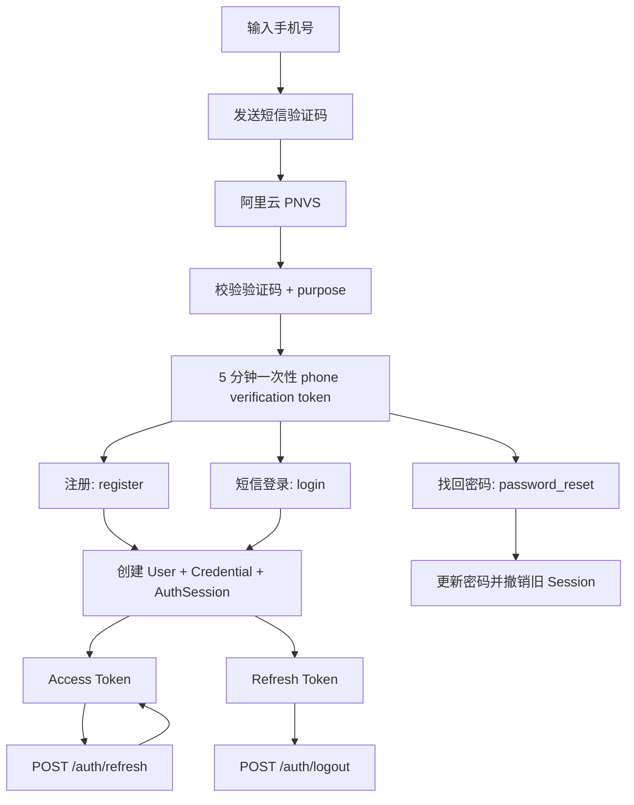
```mermaid
flowchart TB
    Phone["输入手机号"] --> Send["发送短信验证码"]
    Send --> PNVS["阿里云 PNVS"]
    PNVS --> Verify["校验验证码 + purpose"]
    Verify --> Token["5 分钟一次性 phone verification token"]

    Token --> Register["注册: register"]
    Token --> Reset["找回密码: password_reset"]
    Token --> SmsLogin["短信登录: login"]

    Register --> Session["创建 User + Credential + AuthSession"]
    Reset --> Password["更新密码并撤销旧 Session"]
    SmsLogin --> Session
    Session --> Access["Access Token"]
    Session --> Refresh["Refresh Token"]

    Access --> RefreshAPI["POST /auth/refresh"]
    RefreshAPI --> Access
    Refresh --> Logout["POST /auth/logout"]
```

开发环境可回退 `X-User-Id`，生产环境会关闭开发认证并要求正式密钥与会话。

## 17. 通知、公告、头像与 Demo

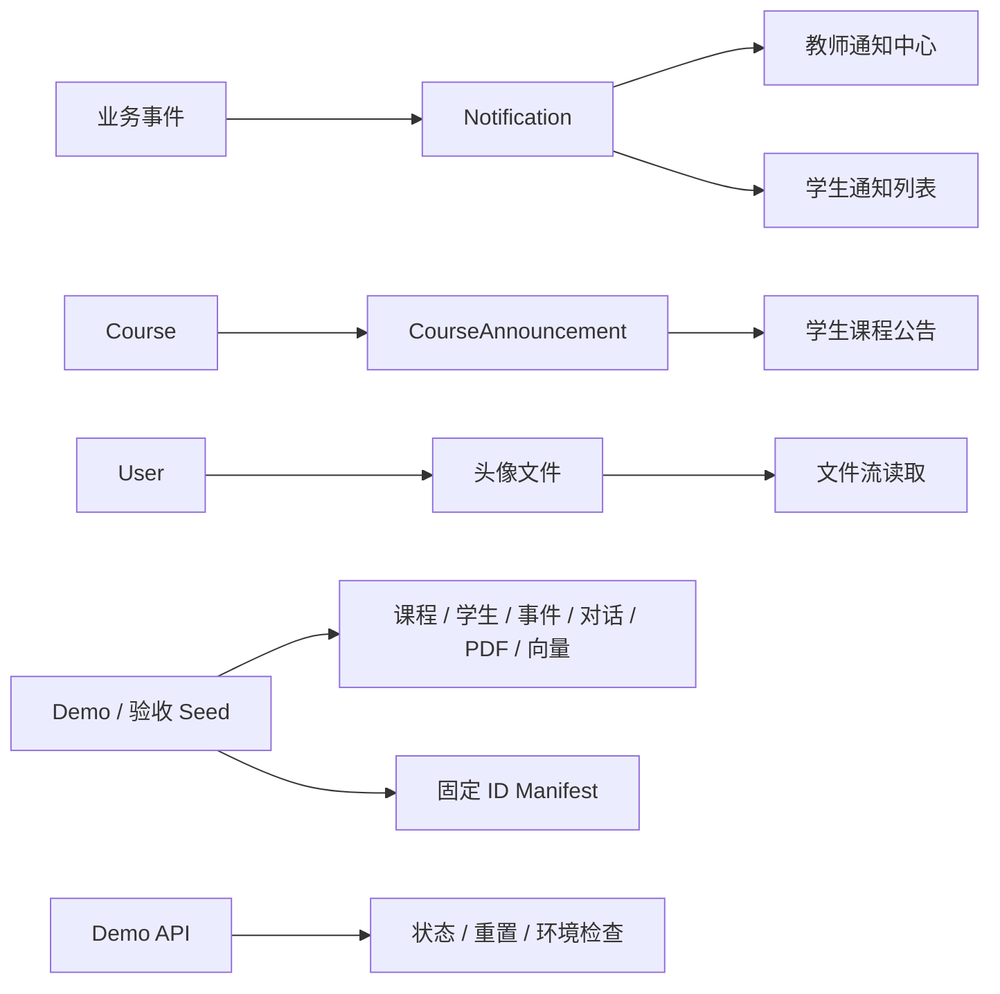
```mermaid
flowchart LR
    Trigger["业务事件"] --> Notification["Notification"]
    Notification --> Web["教师通知中心"]
    Notification --> Mobile["学生通知列表"]

    Course --> Announcement["CourseAnnouncement"]
    Announcement --> Student["学生课程公告"]

    User --> Avatar["头像文件"]
    Avatar --> File["文件流读取"]

    Seed["Demo / 验收 Seed"] --> CourseData["课程 / 学生 / 事件 / 对话 / PDF / 向量"]
    Seed --> Manifest["固定 ID Manifest"]
    DemoAPI["Demo API"] --> Status["状态 / 重置 / 环境检查"]
```

## 18. 后台维护任务

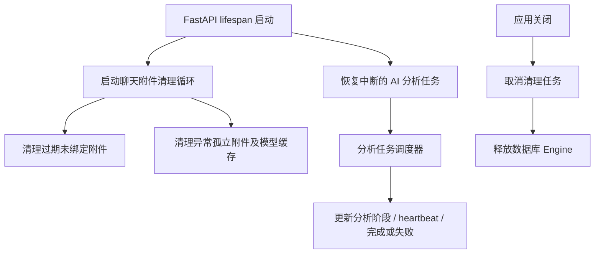
```mermaid
flowchart TB
    Startup["FastAPI lifespan 启动"] --> Recover["恢复中断的 AI 分析任务"]
    Startup --> Cleanup["启动聊天附件清理循环"]
    Cleanup --> Expired["清理过期未绑定附件"]
    Cleanup --> Orphan["清理异常孤立附件及模型缓存"]
    Recover --> Scheduler["分析任务调度器"]
    Scheduler --> Progress["更新分析阶段 / heartbeat / 完成或失败"]
    Shutdown["应用关闭"] --> Cancel["取消清理任务"]
    Cancel --> Dispose["释放数据库 Engine"]
```

## 19. 状态生命周期速查

| 领域 | 状态 |
|---|---|
| 课程 | `draft -> published -> archived`，归档后可恢复为草稿 |
| 文档 | `uploaded -> parsing -> ready`，解析失败为 `failed` |
| 消息 | `streaming / complete / interrupted / failed` |
| 审核 | `open / generating / pending_rereview / regeneration_failed / confirmed_correct / marked_incorrect / dismissed` |
| AI 分析 | `analyzing / completed / failed`，五阶段按固定顺序推进 |
| 教学策略 | `suggested / active / paused / completed` 等教师控制状态 |
| 执行计划 | `draft / published / paused / completed` 等教师控制状态 |
| 计划任务 | 待执行、进行中、完成、跳过等学生或教师动作状态 |
| 学习事件 | `question_asked / hint_requested / quiz_correct / quiz_wrong / concept_confusion / repeated_error / resolved / teacher_adjustment` |

## 20. 当前架构边界

- 当前是单体 FastAPI 加两个前端的单仓架构，不是微服务。
- 课程教材解析、章节识别、切块和向量化仍是四条串行 HTTP 请求，尚未改成完整异步任务流水线。
- AI 二次分析已经使用异步任务和阶段轮询。
- Qwen Chat、Embedding、结构生成和 ASR 全部由后端统一调用。
- 文件当前是本地存储，生产化仍需要对象存储、独立任务队列和更严格的可观测性。
- PostgreSQL + pgvector 是正式数据库目标；SQLite 是开发和测试降级路径。
- 共享契约是跨端唯一网络边界，前端页面不得自行拼接未登记接口或创建第二套类型。
